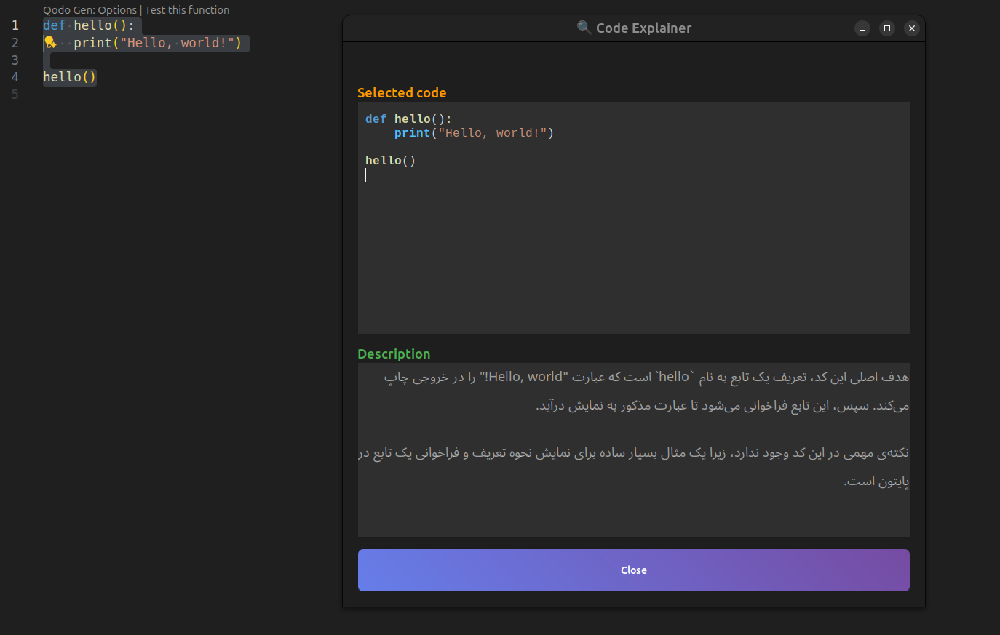

## Code Explainer — Automatic Code Explanation Tool with a Keyboard Shortcut on Linux

Many times, you want to review some code and understand exactly what it does, but you don’t feel like copy-pasting it into an AI tool. With this repo, you can simply highlight the code and press a keyboard shortcut to instantly bring up the code explanation panel right in front of you.

<div style="text-align: center;">
  
  
</div>

This lightweight Linux tool reads the code you’ve selected and uses an LLM (Gemini model) to generate a concise explanation in Persian. The UI is built with GTK3, and you can close the window by pressing Space.

## Features
- **Concise Persian explanation**: A 3–4 line summary of the code’s purpose and key points
- **Two-pane panel**: Shows “Selected Code” and “Explanation” side by side
- **Automatic syntax highlighting**
- **Close shortcut**: Space key

## Prerequisites
- **Operating system**: Linux
- **Python**: Version 3.10 or newer
- **System dependencies**:
  - Debian/Ubuntu:
    ```bash
    sudo apt update
    sudo apt install -y python3 python3-venv python3-pip python3-gi gir1.2-gtk-3.0 xclip libnotify-bin
    ```
  - Fedora/RHEL:
    ```bash
    sudo dnf install -y python3 python3-pip python3-gi gtk3 xclip libnotify
    ```
  - Arch:
    ```bash
    sudo pacman -S --needed python python-pip python-gobject gtk3 xclip libnotify
    ```

## Install Python dependencies
From the repository root:
```bash
cd Code_Explainer
python3 -m venv .venv
source .venv/bin/activate
pip install -r requirements.txt
```

## How to get an API key from [Google AI Studio](https://aistudio.google.com/prompts/new_chat)

To use this project, you need to obtain an API key from Studio AI.
Steps to get the API key:

<a href="https://youtu.be/MziqV5U4U1o?si=iSIGzSf0d6gxK9Wd">
  
</a>

Place the key in `api/gemini_api.py` by replacing the `GEMINI_API_KEY` variable.

## Create a keyboard shortcut to run the module on Linux

To quickly run `main.py` with a keyboard shortcut on Linux, follow these steps:

1. Ensure the script is executable:
    ```bash
    chmod +x path/to/main.py
    ```

2. To create a desktop environment shortcut (e.g., GNOME), go to:

    ```
    Settings → Keyboard → View and Customize Shortcuts → Customize Shortcuts
    ```

3. Create a new custom shortcut and fill in the following:
   - **Name:** Any name (e.g., `Code Explainer`)
   - **Command:** The full path to run `main.py`, for example:
     ```bash
     python3 /full/path/to/main.py
     ```
   - **Shortcut:** Your preferred key combo (e.g., Ctrl+Q)

4. Test the saved shortcut. When you press the defined key combo, the script should run.


